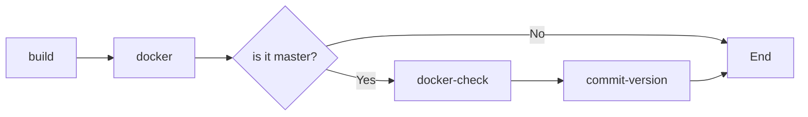

# gradle-hello-world
# Java Hello World using the Gradle Wrapper and the Kotlin DSL
This is a Hello World project that contains the most important parts of the Gradle build scripts.

# Tasks
```
build - Compiles Hello World and creates JAR files.
2 jar files will be created:
- gradle-hello-world-all.jar - this jar contains everything.
- gradle-hello-world.jar - this is regular jar, it contains only the project's classes.
```

# Build
```
./gradlew build
The jar files located ar gradle-hello-world/build/libs/
make the runnable jar executable then, use "java -jar gradle-hello-world-all.jar"
```


# Gradle Hello World

This project is a simple Java "Hello World" application built with Gradle. It demonstrates a CI/CD pipeline that compiles the code, packages it into a JAR file, and builds a Docker image using a multi-stage Docker build.

## Project Overview

- **Programming Language:** Java
- **Build Tool:** Gradle (using the Gradle Wrapper)
- **Artifact:** JAR file generated from the Gradle build
- **Docker:** A Docker image is created from the JAR file using a multi-stage build to ensure minimal image size and non-root execution.

## CI/CD Workflows

This repository includes two GitHub Actions workflows that operate based on the branch being updated:



1. **Master Branch Workflow:**
   - **Trigger:** Runs only on the `master` branch.
   - **Actions:**
     - **Version Update:** Automatically increments the patch portion of the JAR version (e.g., `1.0.0` → `1.0.1`).
     - **Build & Package:** Compiles the code and packages it into a JAR file.
     - **Artifact Upload:** Archives the JAR file as a build artifact.
     - **Docker Build & Push:** Builds a Docker image using the updated JAR file, tags the image with the new version, and pushes it to Docker Hub.
     - **Download the docker image:** Download the image and run!

2. **Non-Master Branch Workflow:**
   - **Trigger:** Runs on all branches except `master`.
   - **Actions:**
     - **Build & Package:** Compiles the code and packages it into a JAR file.
     - **Docker Build:** Builds a Docker image for testing purposes.
     - **Run container:** tests the container.

