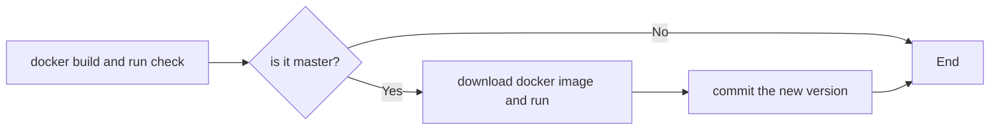

# gradle-hello-world
# Java Hello World using the Gradle Wrapper and the Kotlin DSL
This is a Hello World project that contains the most important parts of the Gradle build scripts.

# Tasks
```
build - Compiles Hello World and creates JAR files.
2 jar files will be created:
- gradle-hello-world-all.jar - this jar contains everything.
- gradle-hello-world.jar - this is regular jar, it contains only the project's classes.
```

# Build
```
./gradlew build
The jar files located ar gradle-hello-world/build/libs/
make the runnable jar executable then, use "java -jar gradle-hello-world-all.jar"
```

# CI/CD Workflows

This repository includes two GitHub Actions workflows that operate based on the branch being updated:



1. **Master Branch Workflow:**
   - **Trigger:** Runs only on the `master` branch.
   - **Actions:**
     - **Docker Build and run:** Builds a Docker image, runs test, and tags the image with the new version and latest.
     - **Docker push:** Pushes the images to Docker Hub.
     - **Download the docker image:** Pulles the new image and runs!
     - **Version Update:** Automatically increments the patch portion of the JAR version (e.g., `1.0.0` → `1.0.1`).

2. **Non-Master Branch Workflow:**
   - **Trigger:** Runs on all branches except `master`.
   - **Actions:**
     - **Docker Build:** Builds a Docker image for testing purposes.
     - **Run container:** tests the container.

